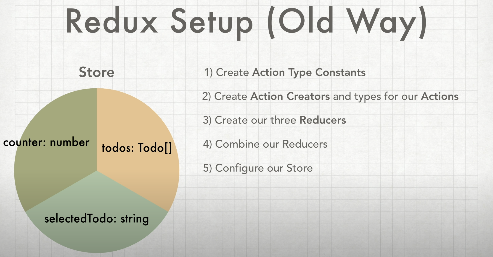
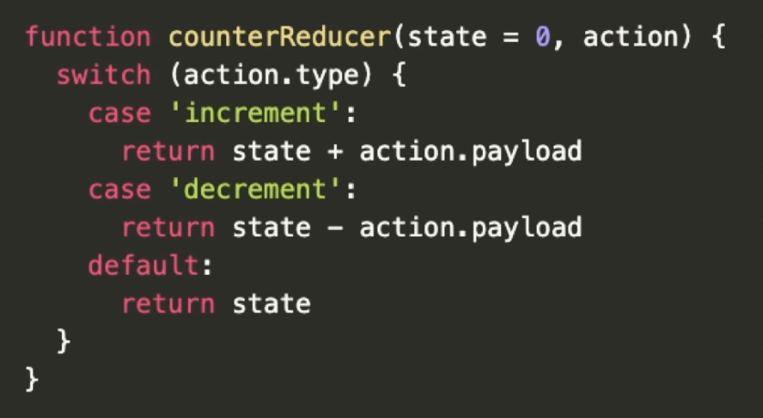
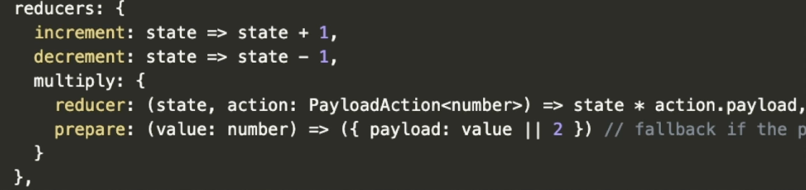
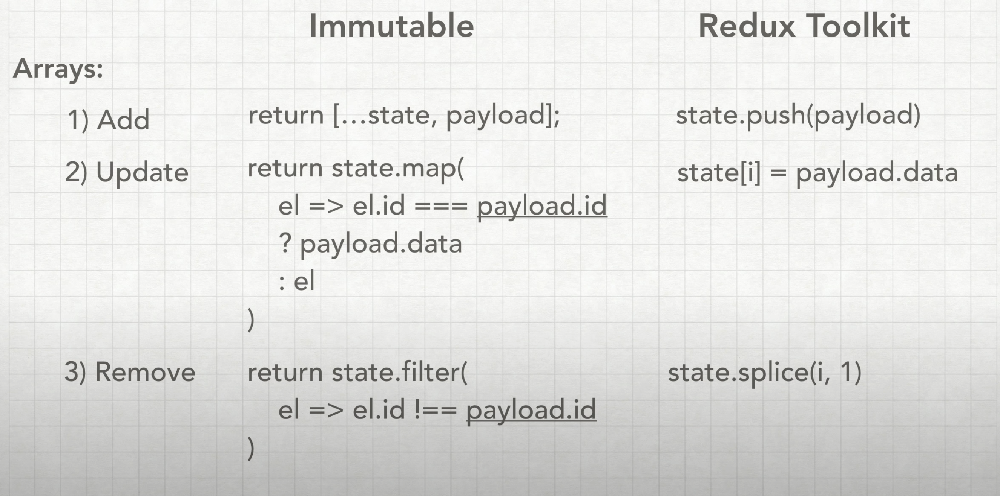
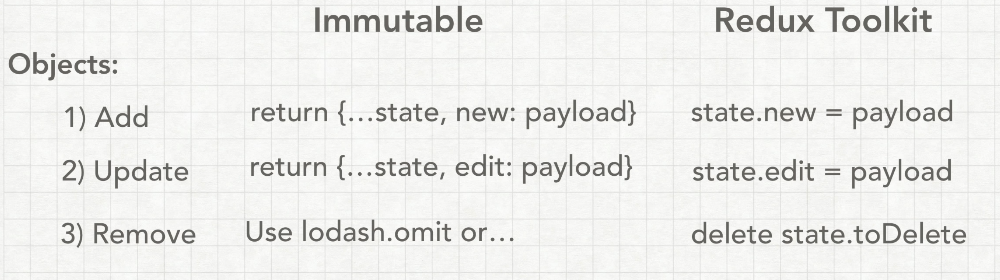
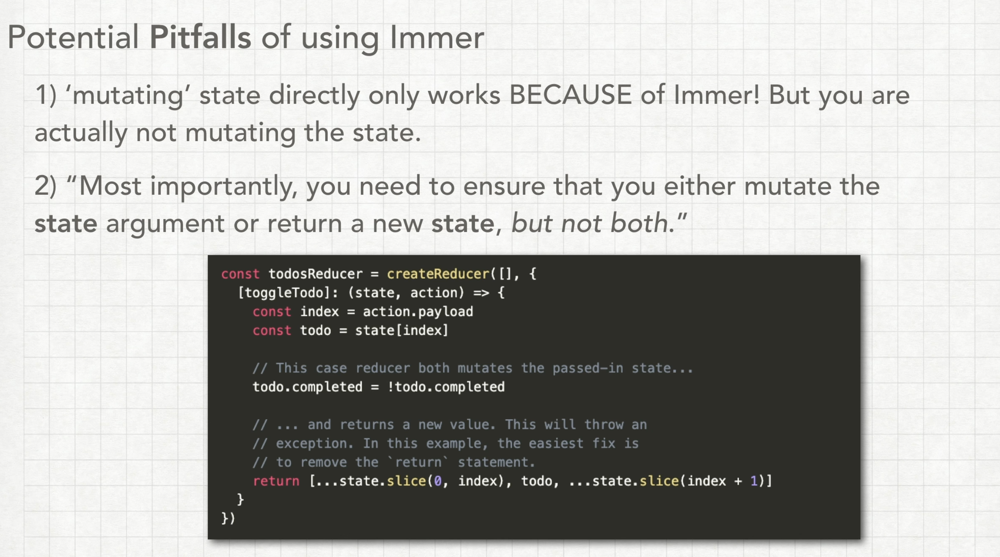

This application was created by following a [YouTube Video](https://www.youtube.com/watch?v=9lCmbth63k0) from [Justin Kim](https://www.youtube.com/channel/UCEA2aEANvCH0evxQni-LIQg)


## How was this project created?

1) Used the Typescript template create-react-app project by running <br />
`npx create-react-app rtk --template typescript`
2) Installed `prettier` and created the `.eslintrc.json` file to link prettier and ESLint together.
3) Installed `uuid` and `@types/uuid` to be able to generate unique IDs.
4) Removed most of the starter code that CRA gives you and created the template that you see above.

## How to start the app?

Go to the root directly, open up the terminal, and type `npm start`

## What I learned?
### Redux Toolkit Packages

- Includes main `redux` package.
- Doesn’t include `react-redux` package. So if you want to use it with React, you need to use `react-redux` to use it.
- Comes with out of the box `redux-devtools-extension` which can be configured as to whether you want to use it or not.
- Comes with `redux-thunk` to handle `async`  requests. You can configure `redux-saga` separately as well if you want.
- `reselect`: Memoizes your selectors. Whenever you grab things from your store, you can memoize it, so that it doesn’t rerender your components needlessly.
- `redux-immutable-state-invariant`: Gives an error whenever we try to mutate our state directly as it’s not allowed in reducers. 
It’s not to be used in production as it copies a lot of files and may impact your application’s performance.
- `immer`: It allows to work with immutable state in a more convenient way. Based on the `copy-on-write` mechanism. 
It actually doesn’t mutate the state, however, creates a draft of the current state in-between and updates the draft. Once all the updates are completed, it returns the new state based on the updates to the draft state.
You can interact with your data by simply modifying it while keeping all the benefits of the immutable data.
**Note**: `immer` can't work with primitive data types e.g. `number`, `boolean` etc. So in case the state is a primitive value, just return the updated state.

### Redux Toolkit API’s

- `createReducer` and `createAction` usually isn’t used much as we use `createSlice` to achieve both.
- `createSlice` is extensively used to create reducer functions in React Toolkit. It essentially is a function that accepts an initial state, an object of reducer functions and a ‘slice name’ to automatically generate action creators and action types corresponding to the reducers and state. Internally, it uses `createReducer` and `createAction`.
    
    ```jsx
    import { createSlice } from '@reduxjs/toolkit'
    
    const initialState = { value: 0 }
    
    const counterSlice = createSlice({
    	name: 'counter', // Name of the slice of the state
    	initialState, // The initial state of the slice (required)
    	// Reducer function
    	reducers: {
    		// This will give us action types and action creators by the same name automatically
    		increment: (state) => {
    			state.value++
    		},
    		decrement: (state) => {
    			state.value--
    		},
    		incrementByAmount: (state, action) => {
    			state.value += action.payload
    		}
    	},
    	extraReducers: {}
    })
    
    export const { increment, decrement, incrementByAmount } = counterSlice.actions
    export default counterSlice.reducer
    ```
    
    Whenever, we need to update states on the basis of other action types or action creators, we use the `extraReducers` property.
    It also provides us reducers as well.
    
- `configureStore` is an abstraction over Redux’s `createStore` function that adds good defaults to the store setup for a better development experience.
    - We don’t need to call `combineReducers` as it’s done automatically by `configureStore`.
    - `getDefaultMiddleWare()` contains all the default middlewares that’s present in Redux Toolkit e.g. `thunk`. So, if no middleware key is provided, it applies getDefaultMiddle()
    - If you want to remove default middleware, provide an empty array(`[]`).
    - If you want to have default + additional middleware:
        
        ```jsx
        middleware: (getDefaultMiddleware) => getDefaultMiddleware().concat(logger),
        ```
        
    - To turn off devTools:
        
        ```jsx
        // Dev Tools is turned on by default, make sure to turn it off in production
        devTools: process.env.NODE_ENV !== 'production'
        ```
        
    - Check out `preLoadedState` and `enhancers`.

### Redux Setup (Old Way)



**Action Types & Actions:**

`CREATE_TODO, EDIT_TODO, TOGGLE_TODO, DELETE_TODO, SELECT_TODO`

```jsx
interface CreateTodoActionType {
	type: typeof CREATE_TODO;
	payload: Todo // export interface Todo {id: string; desc: string; isComplete: boolean;}
}
```

**Action Creators:**

```jsx
export const createTodoActionCreator = ({desc}: {
    desc: string,
}): CreateTodoAction => {
		// Creates an action object or action with the type and the payload
    return {
        type: CREATE_TODO, // Action Type
        payload: {         // Payload
            id: uuid(),
            desc,
            isComplete: false,
        }
    }
}
```

**Reducer:**

```jsx
// Reducer function takes in a previous state, which is initially initialized and takes an action
const todosReducer = (state: Todo[] = todosInitialState, action: TodoActionTypes) => {
    switch (action.type) {
        // We can't mutate the state directly, so we create a new one
				// Updates the store as per the action and returns the new state
        case CREATE_TODO: {
            const { payload } = action;
            return [...state, payload];
        }
        ...
        default:
            return state; // If no recognizable action is fired, then return the default state
    }
}
```

If you want to combine multiple reducers into one:

```jsx
const reducers = combineReducers({
    todos: todosReducer, // The piece of state from the store
    selectedTodo: selectedTodoReducer,
    counter: counterReducer,
})
```

**Store:**

```jsx
export default createStore(
    reducers, // Reducers
    composeWithDevTools(
        applyMiddleware(thunk, logger), // Adding middlewares
    )
);
```

**Using Redux in our components:**

1. Connect the Top level component to the store by using a `Provider`
    
    ```jsx
    <Provider store={store}> // The store to use
    	<App />
    </Provider>
    ```
    
    Now you can access the store in any part of your application.
    
2. There are to ways to use the data and reducer of store:
    1. `mapDispatchToProps` and `mapStateToProps`
        
        ```jsx
        // Map state to Props will map the state of the store to the component
        function mapStateToProps(state) {
          const { todos } = state
          return { todoList: todos.allIds }
        }
        
        // Mapping actions creators to props of a component, so that we can invoke them from the components
        const mapDispatchToProps = dispatch => {
          return {
            toggleTodo: todoId => dispatch(toggleTodo(todoId))
          }
        }
        
        export default connect(mapStateToProps,mapDispatchToProps)(TodoList)
        ```
        
    2. The current latest standard is to use `useDispatch()` hook and `useSelector()` hook
        
        ```jsx
        const dispatch = useDispatch();
        const todos = useSelector((state: State) => state.todos);
        const selectedTodoId = useSelector((state: State) => state.selectedTodo);
        const editedCount = useSelector((state: State) => state.counter);
        ....
        dispatch(createTodoActionCreator({desc: newTodoInput}));
        ```
        

### Redux Toolkit Setup

In this case, you don’t need to create separate Action constants and Action creators.

- **Slices:**
    
    ```jsx
    // Create Slices
    // Automatically creates action creators and action types for the given reducer and state
    const todosSlice = createSlice({
        name: 'todos',
        // Non-primitive state
        initialState: todosInitialState, // Mandatory parameter
        reducers: {
            // Action creators
            // Usually action creators consist of two things:
            // 1. key which is used to identify the action
            // 2. a function to update the state
            // Since we need to call uuid() to create ID, and the reducer is supposed to be a pure function, we need to write create in the following manner:
            // Action Type: todos/create
            create: {
    						// state: Current State
    		        // action: Action
    		        // When we use createSlice, we need to have a payload in the action›
    			      // To specify the payload, we use the PayloadAction type. This automatically defines the action
                reducer: (state, action: PayloadAction<{id: string; desc: string; isComplete: boolean}>) => {
                    state.push(action.payload);
                },
                // Prepares our action in a way that the reducer can use it
                prepare: ({ desc }: { desc: string }) => ({
                    payload: {
                        id: uuid(),
                        desc,
                        isComplete: false,
                    }
                }),
            },
            // Action Type: todos/edit
            edit: (state, {payload}: PayloadAction<{id: string, desc: string,}>) => {
                // Using immer, we can mutate the state value directly
                const todoToEdit = state.find(todo => todo.id === payload.id);
                if(todoToEdit) {
                    todoToEdit.desc = payload.desc;
                }
            },
            // Action Type: todos/toggle
            toggle: (state, {payload}: PayloadAction<{id: string, isComplete: boolean,}>) => {
                const todoToToggle = state.find(todo => todo.id === payload.id);
                if(todoToToggle) {
                    todoToToggle.isComplete = payload.isComplete;
                }
            },
            // Action Type: todos/delete
            remove: (state, {payload}: PayloadAction<{id: string,}>) => {
                const index = state.findIndex(todo => todo.id === payload.id)
                if(index !== -1) {
                    state.splice(index, 1);
                }
            }
        }
    });
    
    const selecetedTodoSlice = createSlice({
        name: 'selectedTodo',
        // Primitive type of state
        initialState: null as string | null,
        reducers: {
            // In case of primitive state, just return the state as mutating the state won't work in redux-toolkit as taht's taken care by immer library
            // Action Type: selectedTodo/select
            select: (state, {payload}: PayloadAction<{id: string}>) => payload.id
        }
    })
    
    // We need to update the counter on any action on the todosSlice
    const counterSlice = createSlice({
        name: 'counter',
        // Primitive State
        initialState: 0,
        // It doesn't have it's own reducer
        reducers: {},
        // It will update the state on any action on the todosSlice
        extraReducers: {
            [todosSlice.actions.create.type]: (state) => state + 1,
            [todosSlice.actions.edit.type]: (state) => state + 1,
            [todosSlice.actions.remove.type]: (state) => state + 1,
            [todosSlice.actions.toggle.type]: (state) => state + 1,
        }
    })
    ```
    
- **Export the actions:**
    
    ```jsx
    // Export the actions
    export const { 
        create: createTodoActionCreator,
        edit: editTodoActionCreator,
        toggle: toggleTodoActionCreator,
        remove: deleteTodoActionCreator,
    } = todosSlice.actions;
    
    export const { select: selectTodoActionCreator } = selecetedTodoSlice.actions;
    ```
    
- **Combine Reducers:**
    
    ```jsx
    // Combine all the reducers
    const reducers = {
        // For each slice, take their reducers
        todos: todosSlice.reducer,
        selectedTodo: selecetedTodoSlice.reducer,
        counter: counterSlice.reducer
    }
    ```
    
- **Create Store:**
    
    ```jsx
    // Create the store
    export default configureStore({
        // Automatically combines reducers
        reducer: reducers,
        // Automatically connects some of the default middlewares like Thunk
        // We can also add our own middlewares but we need to add the default middlewares first
        // To remove default middleware, add an empty array []
        middleware: (getDefaultMiddleware) => getDefaultMiddleware().concat(logger),
        // Dev Tools is turned on by default, make sure to turn it off in production
        devTools: process.env.NODE_ENV !== 'production'
    })
    ```
    

### Differences between Old Redux and Redux Toolkit:

**Reducers:**

**Old:**



1. must provide initialState.
2. must provide default case.
3. use string literals or constants.
4. need to immutably update the state.

**New:**



1. no initialState defined in `createSlice` and no default case.
2. can optionally prepare your action.
3. uses Immer to allow you to write `mutable` state logic.





### Pitfalls of Immer:




### Handle async Logic using RTK
1. Within your slice, have an error key in case your async call is rejected.
    
    ```jsx
    interface RepoDetailsState {
    	openIssuesCount: number;
    	error: string | null
    }
    
    const initialState: RepoDetailsState = {
    	openIssuesCount: -1,
    	error: null
    }
    ```
    
    Create reducers for both success and rejected state for the async call.
    
    ```jsx
    const repoDetails = createSlice({
    	name: 'repoDetails'
    	initialState,
    	reducers: {
    		getRepoDetailsSuccess(state, action: PayloadAction<RepoDetails>) {
    			state.openIssuesCount = action.payload.open_issues_count
    			state.error = null
    		},
    		getRepoDetailsFailed(state, action: PayloadAction<string>) {
    			state.openIssuesCount = -1
    			state.error = action.payload
    		}
    	}
    })
    
    export const {
    	getRepoDetailsSuccess, 
    	getRepoDetailsFailed
    } = repoDetails.actions
    ```
    
    Separately create your thunk function that either dispatches the success or the failed action.
    
    ```jsx
    export const fetchIssuesCount = (
    	org: string,
    	repo: string
    ): AppThunk => async dispatch => {
    	try {
    		const repoDetails = await getRepoDetails(org, repo)
    		dispatch(getRepoDetailsSuccess(repoDetails))
    	} catch(err) {
    		dispatch(getRepoDetailsFailed(err))
    	}
    }
    ```
    
2. We can also use `createAsyncThunk` to make thunk calls.
    
    ```jsx
    import { createAsyncThunk, createSlice } from '@reduxjs/toolkit'
    import { userApi} from './userApi'
    
    // First Create the thunk
    const fetchUserById = createAsyncThunk(
    	'users/fetchIdByStatus',
    	async (userId, thunkApi) => {
    		const response = await userApi.fetchById(userId)
    		return response.data
    	}
    )
    ```
    
    This will generate 3 action types: 
    
    ```jsx
    pending: 'users/requestStatus/pending'
    fulfilled: 'users/requestStatus/fulfilled'
    rejected: 'users/requestStatus/rejected'
    ```
    
    We can then handle the actions in your reducers:
    ```jsx
    // Then handle the actions in your reducers
    const usersSlice = createSlice({
	    name: 'users',
	    initialState: {entities: [], loading: 'idle'},
	    reducers: {
		    // Standard reducer logic, with auto generated actions
	    },
	    extraReducers: {
		    // Add reducers for additional action types here, in this case from the thunk
		    [fetchUsersById.fulfilled]: (state, action) => {
			// Add user to the state array
			state.entities.push(action.payload)
		    }
	    }
    })
    ```